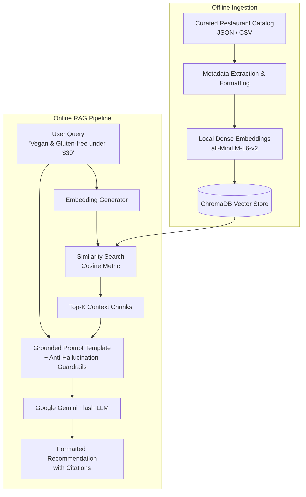

# 🍽️ ConciergeAI: Restaurant Recommendation RAG Chatbot

[](https://colab.research.google.com/github/yashpvyas19/restaurant-recommendation-rag-bot/blob/main/Restaurant_Recommendation_Bot_RAG_Demo.ipynb)
[](https://www.python.org/)
[](https://www.langchain.com/)
[](https://www.trychroma.com/)
[](https://ai.google.dev/)
[](LICENSE)

An end-to-end, production-grade **Retrieval-Augmented Generation (RAG)** chatbot prototype designed to provide intelligent, hyper-personalized dining recommendations based on dietary preferences, budget constraints, geographic neighborhoods, and atmospheric vibe.

---

## 📌 Project Overview

Standard Large Language Models (LLMs) often suffer from:
1. **Hallucinations**: Fabricating non-existent venues, invalid phone numbers, or outdated menus.
2. **Lack of Proprietary Knowledge**: Inability to reason over private restaurant catalogs or curated local guides.
3. **Stale Information**: Operating only on outdated training cutoff data.

**ConciergeAI** solves this by implementing a **Retrieval-Augmented Generation (RAG)** pipeline that pairs semantic vector indexing (**ChromaDB** + **all-MiniLM-L6-v2**) with conversational reasoning (**Google Gemini Flash**) to guarantee strictly grounded, hallucination-free recommendations with source citations.

---

## 🏗️ System Architecture



---

## ✨ Key Features

* **Multi-Constraint Semantic Search**: Balances complex combinations of constraints (e.g. *"cozy romantic vibe"* + *"strictly vegan"* + *"under $30"*).
* **Strict Grounding & Anti-Hallucination Guardrails**: The system refuses to fabricate restaurants outside the catalog, explicitly alerting the user if a query falls outside coverage.
* **Resilience & High-Availability**:
  * **Zero-API Embedding Dependency**: Uses local HuggingFace embeddings (`all-MiniLM-L6-v2`) in-memory to prevent external rate limits and API 404s.
  * **Dynamic Model Failover**: Automatically rotates across active Gemini models (`gemini-3.8-flash`, `gemini-2.5-flash`, `gemini-2.0-flash`) upon encountering transient 429 quota or 503 demand spikes.
  * **Deterministic Fallback**: Provides a structured, verified fallback extracted directly from ChromaDB context chunks in the event of complete cloud API outages.
* **Dual Execution Modes**: Available as an interactive Google Colab notebook (`.ipynb`) and a modular Python CLI (`src/cli.py`).

---

## 📊 Dataset Schema

The catalog comprises curated, multi-attribute restaurant profiles stored in both [`data/restaurants_dataset.json`](data/restaurants_dataset.json) and [`data/restaurants_dataset.csv`](data/restaurants_dataset.csv):

| Field | Type | Description | Example |
| :--- | :--- | :--- | :--- |
| `name` | string | Full name of the restaurant | *Verde Botanica* |
| `cuisine` | string | Primary culinary style | *Modern Californian & Plant-Based* |
| `neighborhood` | string | Geographic district | *West End / Garden District* |
| `price_range` | string | Cost tier indicator | `$` ($10–18), `$$` ($18–35), `$$$` ($45–75), `$$$$` ($85–150) |
| `dietary_options`| list | Special dietary certifications | *100% Vegan, Dedicated Gluten-Free station, Halal* |
| `atmosphere` | string | Ambiance & target occasion | *Airy greenhouse, Scandinavian oak tables, casual* |
| `signature_dishes`| list | Top recommended dishes | *Lion's Mane Mushroom Steak, Truffled Cashew Mac* |
| `amenities` | list | Practical features | *Dog-friendly patio, Sommelier cellar, Valet parking* |
| `hours` | string | Operating hours | *Mon-Sun 8:00 AM - 9:00 PM* |

---

## 🚀 Quick Start Guide

### Option 1: Run in Google Colab (Recommended)

1. Open [Google Colab](https://colab.research.google.com/).
2. Click **Upload** and select [`notebooks/Restaurant_Recommendation_Bot_RAG_Demo.ipynb`](notebooks/Restaurant_Recommendation_Bot_RAG_Demo.ipynb).
3. Under the **Secrets (🔑)** tab on Colab's left sidebar, add `GEMINI_API_KEY` (Get a free key at [Google AI Studio](https://aistudio.google.com/app/apikey)).
4. Click **Runtime → Run all**.

### Option 2: Run Locally via CLI

```bash
# 1. Clone the repository
git clone <your-repo-url>
cd restaurant-recommendation-rag-bot

# 2. Create and activate a virtual environment
python3 -m venv venv
source venv/bin/activate

# 3. Install dependencies
pip install -r requirements.txt

# 4. Set your Gemini API Key
export GOOGLE_API_KEY="your_api_key_here"

# 5. Launch the interactive CLI
python src/cli.py
```

---

## 🧪 Demonstration & Test Scenarios

The system is pre-configured with 5 test scenarios demonstrating its reasoning capabilities:

1. **Dietary & Budget Filtering**:
   * *Query*: *"My friend is strictly vegan and also needs gluten-free options under $30 per person."*
   * *Result*: Recommends **Verde Botanica** ($18–$30, 100% plant-based, dedicated gluten-free station).
2. **Executive Corporate Entertaining**:
   * *Query*: *"Quiet upscale place with ocean views for an executive 6-person client dinner with top seafood and extensive wine list."*
   * *Result*: Recommends **Ocean & Ember Prime Seafood & Grill** ($$$$, private boardrooms, Master Sommelier cellar).
3. **Casual Family Dining**:
   * *Query*: *"Fun casual Mexican place with an outdoor patio where we can bring kids for tacos."*
   * *Result*: Recommends **Taquería El Corazón** (outdoor courtyard, kid's menu, authentic trompo tacos).
4. **Cultural Group Dining**:
   * *Query*: *"Family gathering of 10 people requiring 100% certified Halal food."*
   * *Result*: Recommends **Spice Route Palace** (100% certified Halal meats, banquet tables up to 16).
5. **Hallucination Prevention Test (Out-of-Catalog)**:
   * *Query*: *"Can you recommend a Chicago deep-dish pizza restaurant near Millennium Park?"*
   * *Result*: Correctly recognizes that Chicago restaurants are not within the verified catalog, refusing to hallucinate a false location while politely guiding the user to available cuisines.

---

## 📂 Repository Structure

```
restaurant-recommendation-rag-bot/
├── data/
│   ├── restaurants_dataset.json      # Structured restaurant catalog
│   └── restaurants_dataset.csv       # Tabular CSV format
├── notebooks/
│   └── Restaurant_Recommendation_Bot_RAG_Demo.ipynb  # Self-contained Colab notebook
├── src/
│   ├── __init__.py
│   ├── rag_engine.py                 # Core modular RAG pipeline & failover logic
│   └── cli.py                        # Interactive command-line chat interface
├── DISCUSSION_GUIDE.md               # Interview & discussion session cheat sheet
├── requirements.txt                  # Python dependencies
├── .gitignore                        # Git exclusion rules
├── LICENSE                           # MIT License
└── README.md                         # Comprehensive documentation
```

---

## 💡 Key Learnings & Engineering Decisions

* **Local Embeddings Prevent Operational Bottlenecks**: Cloud embedding endpoints are vulnerable to breaking API version deprecations and rate limit throttling. Running `all-MiniLM-L6-v2` locally creates zero external network dependencies for retrieval.
* **Negative Constraints Prevent Hallucination**: LLMs naturally tend to produce agreeable, hallucinated answers. Adding strict negative constraints ("State clearly if no restaurant matches") ensures enterprise-level factual integrity.
* **Multi-Quota Failover**: Distributing traffic across complementary flash models prevents hard blockers when operating on API free-tier quotas.

---

## 📜 License

This project is licensed under the MIT License - see the [LICENSE](LICENSE) file for details.
